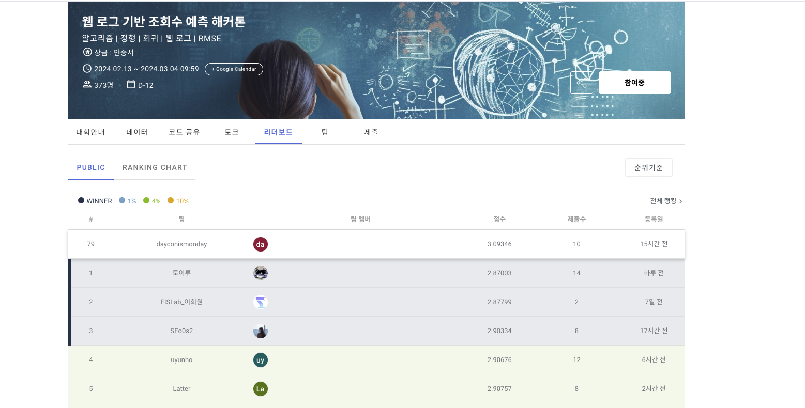

# 웹 로그 기반 조회수 예측 해커톤 
- Data_Visualization을 끝낸 후 실제 데이콘 경진대회 데이터를 활용하여 웹 로그 기반으로 조회수를 예측해보는 해커톤

> ### 배경 
안녕하세요!

해커톤 40회, 웹 로그 기반 조회수 예측 해커톤에 오신 것을 환영합니다.  

이번 데이콘 해커톤은 웹 로그 데이터를 분석해서 조회수를 예측하는 것을 목표로 합니다. 

이 대회를 통해 참가자들은 현업에서 자주 활용되는 웹에서 발생하는 복잡한 데이터를 분석할 기회를 얻고, 

이를 활용한 머신러닝 알고리즘을 개발해 볼 수 있을 것입니다. 

> ### 주제
웹 로그 데이터를 기반으로 조회수 예측

> ### 설명
다양한 웹 로그를 활용하여 한 세션에서 발생하는 조회수를 예측

> ### 주최 / 주관
데이콘

> ### 참가자격
데이커라면 누구나

> ### 평가 산식
RMSE

> ### data
[웹 로그 기반 조회수 예측 해커톤](https://dacon.io/competitions/official/236226/overview/description)

## 리포트 코드
[Daycon.ipynb](./Daycon.ipynb)

## 데이콘 리더보드 제출 해보기
- 점수: 3.09346 (dayconismonday)

